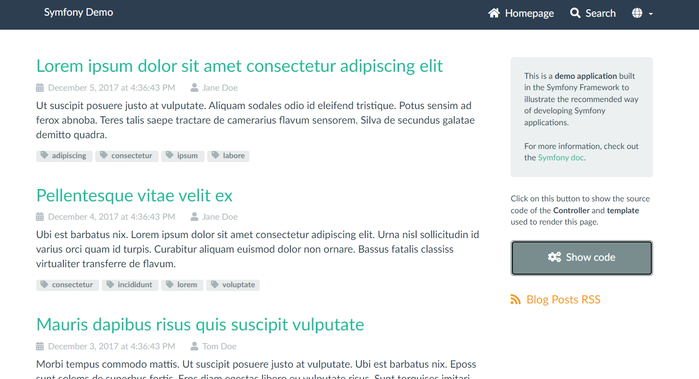
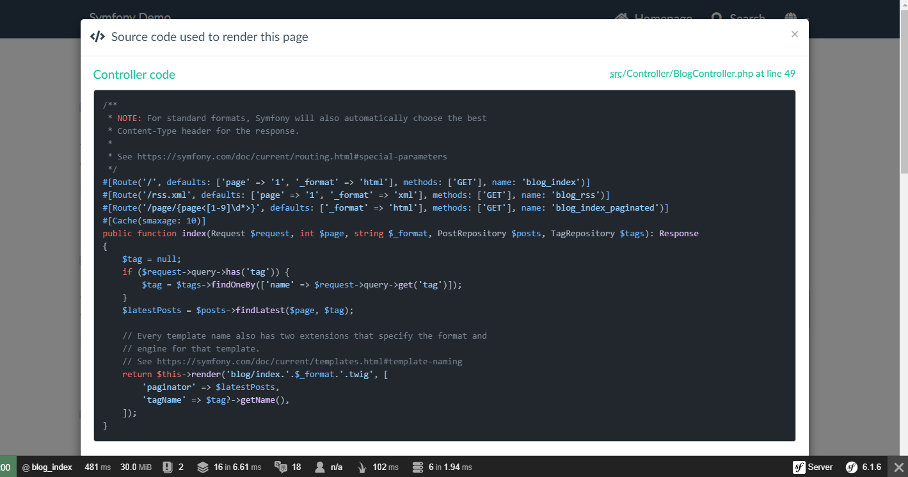
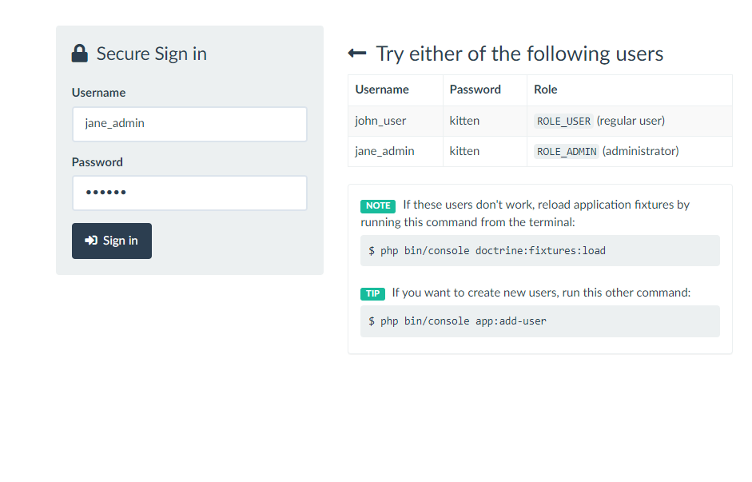

Demo Symfony
========================

Requirements
------------

  * PHP 8.1.0 or higher;
  * PDO-SQLite PHP extension enabled;

Usage
-----

There's no need to configure anything to run the application. If you have
[installed Symfony][4] binary, run this command:

```bash
$ cd demo-symfony/
$ symfony serve
```

Then access the application in your browser at the given URL (<https://localhost:8000> by default).

Tests
-----

Execute this command to run tests:

```bash
$ cd my_project/
$ ./bin/phpunit
```

[1]: https://symfony.com/doc/current/best_practices.html
[2]: https://symfony.com/doc/current/setup.html#technical-requirements
[3]: https://symfony.com/doc/current/setup/web_server_configuration.html
[4]: https://symfony.com/download
[5]: https://symfony.com/book

Screenshots
-----



